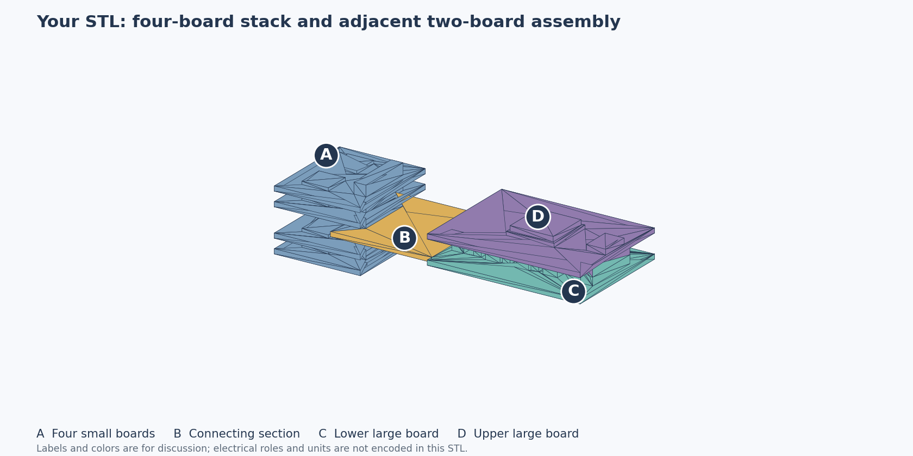
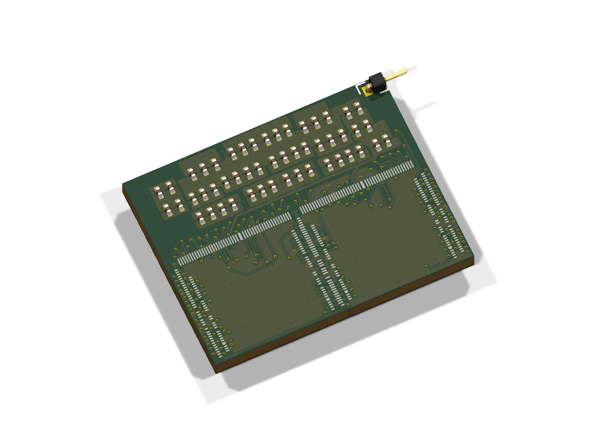
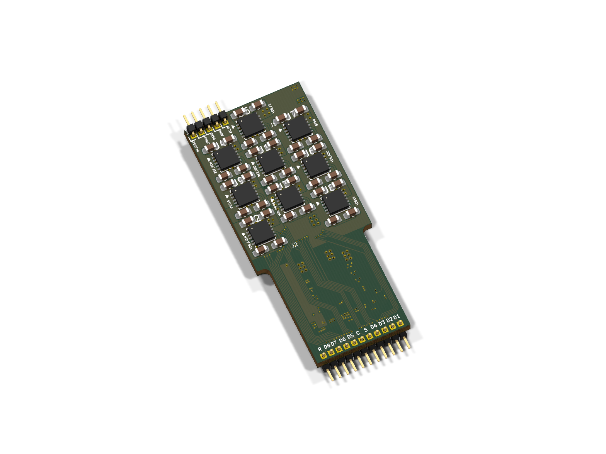

# FPGA_4K

Shared PCB development for the 4K neural-recording system: working designs, interface decisions, reference boards and acquisition software.

## Start working with the team

**[Team start page](docs/team/README.md)** · **[Setup and daily workflow](CONTRIBUTING.md)** · **[Owners and open work](docs/team/owners-and-work.md)**

| Work | Start here | Status |
|---|---|---|
| FPGA design | [Open the working draft](hardware/fpga-board/README.md) | Imported September 21; incomplete electrical design; **not for manufacture** |
| Carrier and routing boards | [Original reference projects](hardware/README.md) | Preserved references; active baselines and owners to confirm |
| Tasks and layout ownership | [Create a PCB task](https://github.com/HowardWHSrun/FPGA_4K/issues/new?template=pcb-task.yml) | One active layout editor per board |
| Pinout / power / protocol decisions | [Create a decision](https://github.com/HowardWHSrun/FPGA_4K/issues/new?template=interface-decision.yml) | Review with owners on both sides |
| Proposed changes | [Pull requests](https://github.com/HowardWHSrun/FPGA_4K/pulls) | Branch → review → merge → pull |

Use KiCad **10.0.6** for the FPGA handoff. Clone the repository, open the project from your clone, and keep its custom libraries alongside it. Follow [CONTRIBUTING.md](CONTRIBUTING.md) before editing; uploading a draft does not approve its circuit or make `main` fabrication-ready.

## Board overview

### Overall assembly

[](hardware/assembly/README.md)

The earlier assembly concept shows the four-board ASIC-carrier stack, routing section and FPGA board. **[Open the 3D model and region guide](hardware/assembly/README.md)** · [Download STL](hardware/assembly/stacked_headboard_original.stl?raw=true). The original model is preserved; dimensions are provisional and its author is unverified.

### Supplied board references

| ASIC carrier reference | LDO/routing reference |
|---|---|
| [](hardware/overview.md#asic-carrier-pcb-5) | [](hardware/overview.md#ldorouting-reference) |
| Approximately 22 × 17 mm; two chip footprints | Approximately 18.3 × 42 mm; regulator area and signal routing |

These are renders of the supplied reference boards; unavailable custom 3D models are omitted. Open the **[visual hardware overview](hardware/overview.md)** for the system diagram, original assembly photograph, front/back layouts and editable files. The two references do not represent a completed 4K assembly or a verified mating pair.

## Files

The files below are **included in this repository**. Click a filename to open it, or a download link to save it.

| Material | Files |
|---|---|
| Overall board and system views | [Visual overview](hardware/overview.md) · [Board images and vector layouts](hardware/previews/) · [Original assembly photograph in slide 2](sources/slides/previews/slide-02.png) |
| ASIC/interface slides — 28 slides | [PowerPoint](sources/slides/Chip_FPGA_Interface.pptx) · [Download PPTX](sources/slides/Chip_FPGA_Interface.pptx?raw=true) · [PDF](sources/slides/Chip_FPGA_Interface.pdf) · [Searchable text](docs/slides/asic-interface-text.md) |
| September 17 meeting | [PDF notes](sources/meetings/2026-09-17-notes.pdf) · [Download Word notes](sources/meetings/2026-09-17-notes.docx?raw=true) · [Read online](docs/meetings/2026-09-17.md) |
| ASIC carrier PCB | [KiCad project](hardware/references/asic-carrier/PCB.kicad_pro) · [Schematic](hardware/references/asic-carrier/PCB.kicad_sch) · [Board](hardware/references/asic-carrier/PCB.kicad_pcb) · [Pin spreadsheet](hardware/references/asic-carrier/Pins.xlsx?raw=true) |
| LDO/routing reference | [KiCad project](hardware/references/ldo-routing/PCB.kicad_pro) · [Schematic](hardware/references/ldo-routing/PCB.kicad_sch) · [Board](hardware/references/ldo-routing/PCB.kicad_pcb) |
| FPGA acquisition software | [Included source files](firmware/FPGA_512/) · [Source overview](firmware/README.md) · [Program guide](docs/software.md) |
| Project context and open questions | [Meeting questions](docs/meetings/2026-09-17.md#questions-to-resolve-in-the-next-review) · [Workstreams and interface notes](docs/meetings/2026-09-18-follow-up.md) |

For the full folder, use GitHub's **Code → Download ZIP** or clone the repository. [The document library](docs/library.md) provides a longer index.

## Project context

The recorded system path is **recording chips → routing board → FPGA board → KR260 → PC**. The meeting identifies the FPGA-to-receiver interface, complete signal map, power handoff and startup behavior as open requirements. Dates and uncertainty are retained in the meeting records.

The included FPGA_512 code is an earlier **ECP5/FT600** implementation. It provides acquisition RTL, host software and testbenches; it is not a completed 4K Artix-7 implementation.

## Working with the files

```sh
git clone https://github.com/HowardWHSrun/FPGA_4K.git
cd FPGA_4K
python3 scripts/check_docs.py
python3 scripts/check_hardware.py
```

The source files come with the clone—no separate source download is needed. The check requires Python 3.9+ and Git, and verifies local links and file hashes. See the [software guide](docs/software.md) for program entry points and the [hardware guide](hardware/README.md) for KiCad files.

AI agents should start with [AGENTS.md](AGENTS.md). Source credits, versions and copy details are recorded in [provenance](sources/README.md).

## Latest meeting — 23 September 2026

[Read the meeting, priorities and actions](presentation/meetings/2026-09-23.html) · [Original notes](sources/meetings/2026-09-23-notes.txt) · [System diagram](sources/meetings/2026-09-23-system-view.png). FPGA/package, USB 3.0, connector, exact pins and board size remain open.
