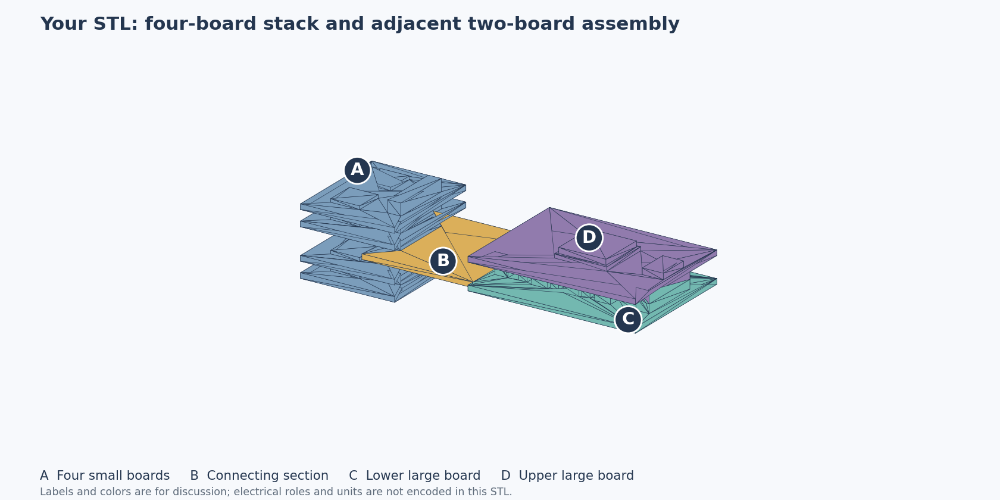
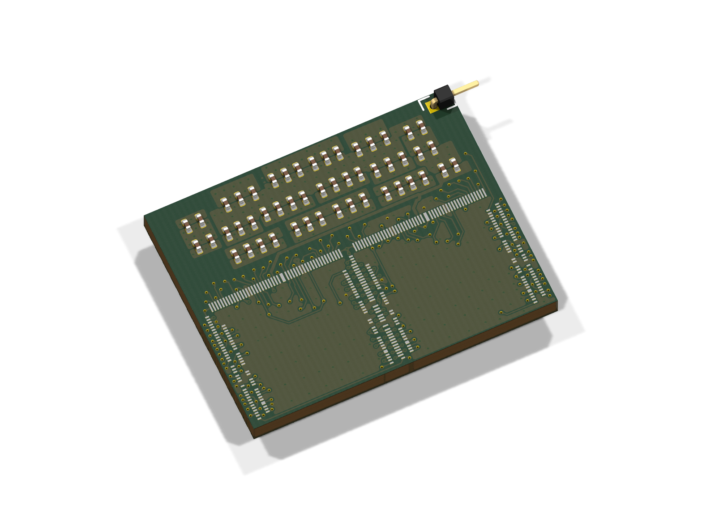
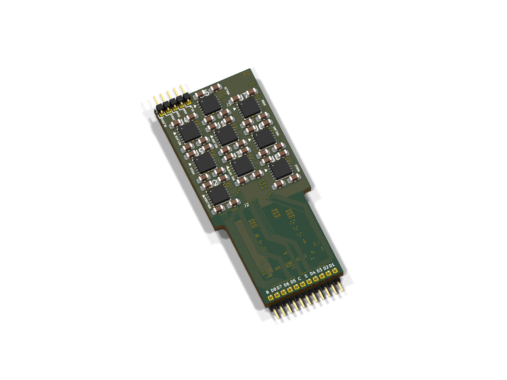

# FPGA_4K

[Native schematic browser](presentation/schematic/?board=adapter) · [selected 25T circuit](presentation/schematic/?board=fpga25t) · [R10 HDI feasibility and editable project](hardware/xem8310-adapter/dated/2026-09-29/r10-hdi-feasibility/README.md). R10 connects all twelve selected GTY pairs and preserves all 160 MC1/MC2 contact paths, with 0 physical DRC violations under provisional HDI rules, 97 opens and 19 parity findings. It requires laser microvias and a qualified stackup; power/JTAG, returns, impedance, pair matching and fit remain incomplete. R9 remains the default viewer baseline, with R10 available as an optional study. Both board schematics can be browsed sheet by sheet and opened as PDFs.

<!-- CURRENT_FPGA_LEARNING_REPORT -->
**Preserved micro-HDMI learning report:** [PDF · 45 pages](hardware/fpga-interface-study/dated/2026-09-27/completion-report/FPGA100T_Current_Learning_Review.pdf) · [editable LaTeX](hardware/fpga-interface-study/dated/2026-09-27/completion-report/FPGA100T_Current_Learning_Review.tex). Explains the earlier 125-component / 752-endpoint checkpoint. It does not cover the USB-C additions.
<!-- /CURRENT_FPGA_LEARNING_REPORT -->


**Earlier learning report:** [Visual explanations and professor briefing · 33-page PDF](hardware/fpga-interface-study/dated/2026-09-26/learning-report/FPGA100T_Learning_And_Professor_Review.pdf). Explains the earlier snapshot; use the current native audit and pin map for the updated design.

**Earlier micro-HDMI component and pin review:** [Earlier presentation](presentation/fpga/micro-hdmi.html#architecture) · [labeled pin map](presentation/fpga/pins/) · [presenter notes](presentation/fpga/data/Presenter_Notes.md). 116 candidate digital ASIC nets have native assignments plus one external analog reservation; 83 pins are intentionally unused and 19 endpoints reserve future interfaces. Six former NC pins are assigned GND. The pin map separates assignments from current copper status.

Shared PCB development for the 4K neural-recording system: working designs, interface decisions, reference boards and acquisition software.

**Selected custom FPGA — XC7A25T-2CSG325I:** [Current board section and native-derived 3D placement](presentation/fpga/current-25t.html). Three separate boards and three cables are proposed. The 25T PCB is unrouted and its inherited rigid DF40 interface is under redesign. The [28 September 50T placement and parts review](presentation/fpga/index.html) remains available as a historical checkpoint; its 48-line purchasing draft is not a 25T order list. **No board is released for fabrication or purchase.**

**Three-port receiver interface — 29 September:** [Adapter overview, exact pin map and interactive 3D](presentation/adapter/) · [R7 five-page KiCad schematic](hardware/xem8310-adapter/dated/2026-09-29/r7-three-port/BRK8310_Three_Port_Adapter_R7_Candidate.pdf) · [editable R7 project](hardware/xem8310-adapter/dated/2026-09-29/r7-three-port/BRK8310_Three_Port_Adapter_R7_KiCad_Project.zip). XEM8310 currently sits directly on BRK8310. The proposed interposer would fit between them and connect three custom FPGA cables to MC3 GTY banks 226, 225 and 224 simultaneously. Matching BRK GTY contacts would be isolated; BRK J6 PCIe is unavailable during three-link acquisition and is only an alternate future mode. The optional R10 HDI study connects all 12 selected signal pairs, with97 items still open; R9 and R8 remain preserved. The three protected 12 V cable branches, physical fit, clock/link, USB capture and programming remain unresolved. Earlier [one-port R3/R4](hardware/xem8310-adapter/dated/2026-09-29/r3-interposer-candidate/README.md) and [direct-XEM R2](hardware/xem8310-adapter/dated/2026-09-29/r2-12v/README.md) remain separate history.

**Earlier FPGA revisions:** [28 September unrouted 50T placement and parts](presentation/fpga/index.html), [preserved routed 100T micro-HDMI checkpoint](presentation/fpga/micro-hdmi.html) and [USB-C development revision](presentation/fpga/usb-c.html) remain separate historical studies. The [28 September 5 V contact proposal](presentation/fpga/micro-hdmi-19.html) is dated history; the [current three-port adapter page](presentation/adapter/) shows the proposed 12 V contact and selected 25T link allocation.

## Start working with the team

**[Team start page](docs/team/README.md)** · **[Setup and daily workflow](CONTRIBUTING.md)** · **[Owners and open work](docs/team/owners-and-work.md)**

| Work | Start here | Status |
|---|---|---|
| Selected custom FPGA | [Open the 25T board section](presentation/fpga/current-25t.html) | Three identical board links proposed; PCB unrouted; DF40 interface under redesign |
| Three-port receiver adapter | [Open the schematic, pin map and 3D](presentation/adapter/) | Logical schematic browsable; R10 all 12 pair endpoints connected under provisional HDI rules;97 opens; power/JTAG unfinished |
| Earlier 50T placement | [Open the 28 September board and parts review](presentation/fpga/index.html) | Historical 50T candidate; not the current selected device or BOM |
| Preserved routed 100T | [Open the earlier micro-HDMI checkpoint](presentation/fpga/micro-hdmi.html) | 125 placed parts; separate routing and population evidence |
| Separate USB-C revision | [Open the development board](presentation/fpga/usb-c.html) | 116 provisional FPGA signals + one analog reservation; unfinished routing; **not for manufacture** |
| Earlier FPGA team draft | [September 21 import](hardware/fpga-board/README.md) | Preserved earlier electrical draft; superseded device/interface choices; **not for manufacture** |
| Carrier and routing boards | [Original reference projects](hardware/README.md) | Preserved references; active baselines and owners to confirm |
| Tasks and layout ownership | [Create a PCB task](https://github.com/HowardWHSrun/FPGA_4K/issues/new?template=pcb-task.yml) | One active layout editor per board |
| Pinout / power / protocol decisions | [Create a decision](https://github.com/HowardWHSrun/FPGA_4K/issues/new?template=interface-decision.yml) | Review with owners on both sides |
| Proposed changes | [Pull requests](https://github.com/HowardWHSrun/FPGA_4K/pulls) | Branch → review → merge → pull |

Use KiCad **10.0.6** for the FPGA handoff. Clone the repository, open the project from your clone, and keep its custom libraries alongside it. Follow [CONTRIBUTING.md](CONTRIBUTING.md) before editing; uploading a draft does not approve its circuit or make `main` fabrication-ready.

## Board overview

### Overall assembly

[](hardware/assembly/README.md)

The earlier assembly concept shows the four-board ASIC-carrier stack, routing section and FPGA board. **[Open the 3D model and region guide](hardware/assembly/README.md)** · [Download STL](hardware/assembly/stacked_headboard_original.stl?raw=true). The original model is preserved; dimensions are provisional and its author is unverified.

### Supplied board references

| ASIC carrier reference | LDO/routing reference |
|---|---|
| [](hardware/overview.md#asic-carrier-pcb-5) | [](hardware/overview.md#ldorouting-reference) |
| Approximately 22 × 17 mm; two chip footprints | Approximately 18.3 × 42 mm; regulator area and signal routing |

These are renders of the supplied reference boards; unavailable custom 3D models are omitted. Open the **[visual hardware overview](hardware/overview.md)** for the system diagram, original assembly photograph, front/back layouts and editable files. The two references do not represent a completed 4K assembly or a verified mating pair.

## Files

The files below are **included in this repository**. Click a filename to open it, or a download link to save it.

| Material | Files |
|---|---|
| Overall board and system views | [Visual overview](hardware/overview.md) · [Board images and vector layouts](hardware/previews/) · [Original assembly photograph in slide 2](sources/slides/previews/slide-02.png) |
| ASIC/interface slides — 28 slides | [PowerPoint](sources/slides/Chip_FPGA_Interface.pptx) · [Download PPTX](sources/slides/Chip_FPGA_Interface.pptx?raw=true) · [PDF](sources/slides/Chip_FPGA_Interface.pdf) · [Searchable text](docs/slides/asic-interface-text.md) |
| September 17 meeting | [PDF notes](sources/meetings/2026-09-17-notes.pdf) · [Download Word notes](sources/meetings/2026-09-17-notes.docx?raw=true) · [Read online](docs/meetings/2026-09-17.md) |
| ASIC carrier PCB | [KiCad project](hardware/references/asic-carrier/PCB.kicad_pro) · [Schematic](hardware/references/asic-carrier/PCB.kicad_sch) · [Board](hardware/references/asic-carrier/PCB.kicad_pcb) · [Pin spreadsheet](hardware/references/asic-carrier/Pins.xlsx?raw=true) |
| LDO/routing reference | [KiCad project](hardware/references/ldo-routing/PCB.kicad_pro) · [Schematic](hardware/references/ldo-routing/PCB.kicad_sch) · [Board](hardware/references/ldo-routing/PCB.kicad_pcb) |
| FPGA acquisition software | [Included source files](firmware/FPGA_512/) · [Source overview](firmware/README.md) · [Program guide](docs/software.md) |
| Project context and open questions | [Meeting questions](docs/meetings/2026-09-17.md#questions-to-resolve-in-the-next-review) · [Workstreams and interface notes](docs/meetings/2026-09-18-follow-up.md) |

For the full folder, use GitHub's **Code → Download ZIP** or clone the repository. [The document library](docs/library.md) provides a longer index.

## Project context

The current interface direction is **recording chips → routing/power → three separate XC7A25T PCBs → three custom µHDMI cables → one proposed interposer → XEM8310 → USB → PC**. The interposer would sit between XEM8310 and the separate BRK8310 breakout. Each cable gets one MC3 GTY bank; the custom FPGA would decode reverse-link commands and generate ASIC controls locally. The three-link mode uses GTY lanes otherwise routed to BRK J6, so PCIe is an alternate future configuration, not a simultaneous PC path. The 25T PCB is unrouted, and R10 is an optional HDI routing feasibility study; cable power, GTP/GTY operation, USB throughput, connector fit and ASIC fanout remain unresolved. Earlier 50T, 100T and KR260 material remains dated history.

The included FPGA_512 code is an earlier **ECP5/FT600** implementation. It provides acquisition RTL, host software and testbenches; it is not a completed 4K Artix-7 implementation.

## Working with the files

```sh
git clone https://github.com/HowardWHSrun/FPGA_4K.git
cd FPGA_4K
python3 scripts/check_docs.py
python3 scripts/check_hardware.py
```

The source files come with the clone—no separate source download is needed. The check requires Python 3.9+ and Git, and verifies local links and file hashes. See the [software guide](docs/software.md) for program entry points and the [hardware guide](hardware/README.md) for KiCad files.

AI agents should start with [AGENTS.md](AGENTS.md). Source credits, versions and copy details are recorded in [provenance](sources/README.md).

## Meeting reviews

**[Open the meeting hub](presentation/meetings/index.html)** for the latest review, action items and earlier records.

### Meeting preparation — 24 September 2026 (historical)

[Preparation and review questions](presentation/meetings/2026-09-24.html) · [Original proposal PDF](sources/meetings/2026-09-24-FPGA_4K_Meeting_Choices.pdf). Proposed choices; no outcomes recorded.

### Latest meeting record — 28 September 2026

[Read the FPGA board review and actions](presentation/meetings/2026-09-28.html). The recording discusses a 50T candidate, block-by-block schematic review and an MCU link plan. Its proposed part choice and pin allocation do not supersede the active design status above; the private recording is not in this repository.

### Earlier meeting record — 23 September 2026

[Read the dated meeting and actions](presentation/meetings/2026-09-23.html) · [Original notes](sources/meetings/2026-09-23-notes.txt) · [System diagram](sources/meetings/2026-09-23-system-view.png). These are the questions recorded at that meeting; the current 100T/XEM8310 uncertainty list above supersedes them as the active status.

### Wednesday presentation - September 30, 2026

[Open the dedicated meeting presentation](presentation/meetings/2026-09-30.html). Six visual slides focused on the 19-contact cable, why the contacts are needed and the three XEM MC3 banks. The three-FPGA / XEM / BRK assembly is the final slide. Includes clickable pin groups, presentation controls and links to native schematics and 3D views. Preparation only; outcomes pending.

[Open the Wednesday visual library](presentation/meetings/2026-09-30-visuals.html): 99 existing figures, schematic sheets, pin diagrams and preserved board revisions.
