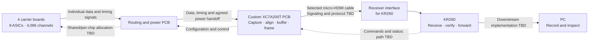

# System architecture and interface boundaries

This is the intended architecture as documented through 18 September 2026. Read [current status](current-status.md) for what has actually been built or checked, and [open questions](open-questions.md) for unresolved interfaces.

The diagram shows functional responsibilities, not a completed electrical circuit. Source: [current decision note](../sources/notes/2026-09-18-current-decisions.md), [routing handoff](../sources/notes/2026-09-18-routing-handoff.md), [meeting record](meetings/2026-09-17.md).

## Acquisition and data budget

The ASIC slides describe 512 recording channels per ASIC, 12-bit conversion, eight serial outputs and a 32 MHz / 1,024-cycle frame corresponding to 31.25 kS/s/channel. Eight ASICs give the 4,096-channel target. Gerald subsequently confirmed the intended 32 MHz ASIC clock. The original [slides](../sources/slides/Chip_FPGA_Interface.pptx), [PDF render](../sources/slides/Chip_FPGA_Interface.pdf), [text extraction](slides/asic-interface-text.md) and [technical follow-up](meetings/2026-09-18-follow-up.md) retain the evidence.

| Representation at the full target | Calculation | Decimal rate |
|---|---|---:|
| Samples | 8 × 512 × 31,250 | 128 million samples/s |
| Packed 12-bit payload | 128 million × 12/8 | 192 MB/s |
| 16-bit sample words | 128 million × 2 | 256 MB/s |
| Prior framing-ratio estimate | 256 MB/s × 132/128 | 264 MB/s = 2.112 Gb/s |

These are calculated rates. The 132/128 ratio comes from the earlier reference framing and does not select the new packet format. Encoding, headers, timestamps, error detection, flow control and engineering margin must be budgeted for the chosen link. The legacy reference drives 16 MHz and uses a 15.625 kS/s/channel host assumption; it is a lower-rate reference mode, not proof of full-rate operation. See [current decisions](../sources/notes/2026-09-18-current-decisions.md) and the [FPGA_512 source snapshot](https://github.com/gt-ic/FPGA_512/tree/767e82528780005cbcb37b3e926197755bac622e).

## Board responsibilities

| Block | Intended responsibility | Boundary that remains open |
|---|---|---|
| ASIC carriers | ASICs and carrier-local support | Authoritative revision, bonding/pin map, existing regulation and mechanical interface |
| Routing/power PCB | Carry individual signals and distribute the agreed supplies | Supply grouping, regulator placement, power direction, mates and complete contact map |
| FPGA PCB | Capture, configure/control, align channels, buffer, frame and transmit | Bank/pin/clock allocation, memory implementation, power design and electrical interfaces |
| Receiver and KR260 | Receive, verify and forward the stream; support commands | Actual physical receiving port/adapter, receive logic/software, throughput and downstream connection |
| PC | Store the stream and support inspection | Receiving/storage performance and behavior on discontinuities |

The routing PCB does not passively merge independent ASIC data outputs. Aggregation occurs in FPGA logic. Proposed routing responsibilities and power boundaries are recorded in [the routing handoff](../sources/notes/2026-09-18-routing-handoff.md).

## ASIC-facing interface

Eight data outputs plus returned clock, READ and SYNC give **11 acquisition outputs per ASIC, or 88 for eight ASICs**. This count excludes configuration/control signals, retained test signals, grounds and power. It is not the connector contact count. Shared controls, per-chip controls, safe startup states and clock loading must be resolved before final pin allocation.

Gerald's **1.5 V reference** confirmation is a nominal value; it does not replace per-pin output levels, thresholds, voltage limits or timing. The ASIC clock target is **32 MHz**; the FPGA's source oscillator is **TBD**. Data-edge timing, capture setup/hold, SYNC use and startup/resynchronization still need an agreed implementation and validation. The reference code leaves SYNC unused, so channel identity must not be assumed from successful data reception alone.

Sources: [current questions](../sources/notes/2026-09-18-current-questions.md), [technical follow-up](meetings/2026-09-18-follow-up.md), [reference RTL](https://github.com/gt-ic/FPGA_512/blob/767e82528780005cbcb37b3e926197755bac622e/adc_4lane_framed/top_4lane_framed.v), [ASIC slides](slides/asic-interface-text.md).

## Micro-HDMI and receiver interface

Micro-HDMI is the selected connector direction. Its exact part, cable, pin assignment, electrical standard, active data pairs, clock arrangement, return commands, protection and termination are unselected. It must not be described as a validated HDMI, TMDS or custom LVDS link.

KR260 has no native HDMI input. Both the transmitter and actual receiver port/adapter must be designed together. A cable or mechanical adapter does not establish electrical compatibility or sustainable bandwidth. The old USB/FX3 architecture is superseded; its parts and bank allocation should not be copied into the current BOM. Source: [current decision note](../sources/notes/2026-09-18-current-decisions.md), which links the manufacturer interface documentation.

## Memory, startup and debugging

- **Configuration flash** stores the FPGA program for automatic startup. The proposed 256 Mbit S25FL256SAGMFI000 is a candidate, not a finalized purchasing choice or implemented recovery system.
- **Recording RAM** temporarily stores samples during downstream stalls. External RAM remains a provisional design block; capacity, device, controller, supply and bank mapping depend on the loss/stall requirement. Boot flash is not a substitute.
- **Dedicated JTAG** provides programming and recovery before an application bitstream is running. Exact connector pitch, pinout, voltage reference and external adapter remain open; historical drafts differ.
- **Clocking** must connect the 32 MHz ASIC requirement to capture, processing, memory and output-link timing. The physical oscillator frequency remains TBD.

Source: [component proposal](../sources/notes/2026-09-18-component-proposal.md), [current questions](../sources/notes/2026-09-18-current-questions.md), [Rev2 open decisions](../hardware/placement/FPGA_PCB_Rev2/README.md). No finite buffer compensates for a permanently slower downstream path.

## Power and physical implementation

The FPGA PCB needs its own complete power and configuration design. ADP5052, four inductors and one dual-MOSFET package are a proposed implementation. Exact loads, rail/bank allocation, compensation, input source, sequencing and thermal behavior remain engineering work. Link or memory choices may add supply requirements.

The routing proposal recovers seven low-voltage regulators per independent supply group from an older reference: five nominal 1.5 V rails, one 1.6 V rail and one 0.75 V rail. Neither the current applicability of every rail nor the number of groups is settled. Reconcile existing carrier regulation before adding it again. The old high-voltage branches are not a verified ±10 V supply. See [routing handoff](../sources/notes/2026-09-18-routing-handoff.md).

The [60 × 70 mm Rev2 study](../hardware/placement/FPGA_PCB_Rev2/README.md) reserves physical space. It has no electrical netlist or routing, unresolved footprint DRC errors and several body-only 3D proxies. The [routing scenarios](../hardware/placement/Routing_PCB/README.md) are also placement studies. Connector heights, carrier overhang, cables, cooling and enclosure must be evaluated together before claiming a system envelope.
