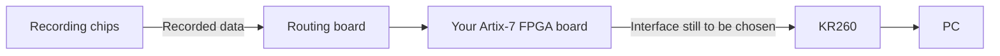

# Understanding Gerald's two shared boards

> Historical source note. Current XC7A200T/micro-HDMI decisions supersede older link/device proposals. See [current status](../current-status.md). Text is retained with navigation adapted; unshipped local references are marked as archive paths.

Reviewed September 17, 2026 against the meeting notes and the supplied KiCad files. This is a reading guide, not an approved circuit specification or a hardware test report. Original design files were left unchanged.

## The main idea

Gerald supplied examples of the **recording-chip side** of the system. They help Howard and Zitong work out what must connect to the new FPGA board.

- **PCB-5:** a compact board carrying two custom recording-chip footprints, their capacitors, and an 80-contact connector.
- **LDO_Board_10SOIC (New Rigid):** an older board that generates recording-chip power supplies and passes signals between connectors.
- **Your FPGA board:** a separate design. Neither new example contains the Artix-7 FPGA, its boot memory, or a completed KR260 interface.

The meeting's intended system is:

This diagram shows the recording-data direction. Clock, configuration, reset and other control signals also travel back toward the chips. Power connections must be planned separately. The two supplied designs illustrate the first two functions; this does not establish that they plug directly into each other.

Source: [September 17 meeting notes](../../sources/meetings/2026-09-17-notes.pdf), pages 1–3.

## 1. PCB-5: the recording-chip board

Open [PCB-5 project](../../hardware/references/asic-carrier/PCB.kicad_pro).

The schematic contains two custom chip instances, `U01_BCD1` and `U01_BCD2`, using `chip:U01_BCD_OFF_CHIP`. Their generic value field is `*`, so the file does not provide a complete commercial part number or revision. The PCB also contains 50 capacitors, an 80-contact Hirose DF40 connector (`J3`), and an AGND connection (`J1`).

In plain language, this is the small board carrying the chips at the recording end of the system. The chips' outputs and support connections are brought to a connector so another board can receive data, deliver control signals, and supply power.

The saved PCB measures approximately **22.0 × 17.0 mm** and has **10 copper layers**. These describe this reference; they are not the dimensions or layer requirement for your FPGA board. The files identify KiCad 10.0 as their generator.

### Why eight data lines do not mean eight channels

Gerald's earlier slide deck describes a 512-channel recording ASIC whose ADC outputs are multiplexed onto eight data lines. Each line carries samples from many recording channels at different times. Thus **channel count, data-wire count, connector-contact count, and chip count are different quantities**.

The new PCB has two chip instances. If these are the 512-channel ASIC revision from the slides, that would mean 1,024 recording channels; the new board files alone do not establish the chip revision or capacity. The meeting target is eight chips / approximately 4K channels, so this is a smaller reference for that larger design.

Evidence: [schematic chip instance](../../hardware/references/asic-carrier/PCB.kicad_sch), [80-contact connector](../../hardware/references/asic-carrier/PCB.kicad_sch), [PCB layers](../../hardware/references/asic-carrier/PCB.kicad_pcb), and [Gerald's earlier slides](../../sources/slides/Chip_FPGA_Interface.pptx), slides 1, 5 and 14.

## 2. LDO board: recording-chip power and signal routing

Open [LDO board project](../../hardware/references/ldo-routing/PCB.kicad_pro).

**LDO means low-dropout linear voltage regulator.** This board's schematic contains nine LT3042 regulators, 43 capacitors, nine resistors, two 50-contact connectors, and individual breakout connections. Analog Devices describes the LT3042 as an ultralow-noise regulator: [manufacturer page](https://www.analog.com/en/products/lt3042.html).

It does two jobs:

1. **Power:** provide separate supply/reference nets for the recording circuitry, including `VDD_FE`, `VDD_ADC`, `VDD_DRIVER`, `DVDD`, `REF_VDD`, `VDD_CGEN`, `REF_VCM`, `VDD10` and `VSS10`.
2. **Routing:** carry data, clocks, resets, programming and stimulation signals through its connectors and traces.

Those rail names help identify which circuit blocks need power. They are not a verified voltage/current specification. In particular, a net called `VDD_ADC` is an ADC supply connection, not evidence that this board contains a separate ADC chip.

The board has no FPGA and no separate ADC IC. Its passive signal routing does not combine multiple data streams into fewer wires. That aggregation is a job for active logic and firmware, such as the planned FPGA.

The saved reference is approximately **18.3 × 42.0 mm**, with **six copper layers**, generated by KiCad 9.0. The meeting explicitly left recording-chip LDO placement open. It separately called for FPGA power circuitry on the FPGA board. Therefore these nine regulator circuits must not be copied as though they are already the required Artix-7 power design.

Evidence: [LDO board nets and layers](../../hardware/references/ldo-routing/PCB.kicad_pcb), [LT3042 instance](../../hardware/references/ldo-routing/PCB.kicad_sch), [50-contact J2](../../hardware/references/ldo-routing/PCB.kicad_pcb).

## What Pins.xlsx tells us

[Pins.xlsx](../../hardware/references/asic-carrier/Pins.xlsx), Sheet1, is a short planning worksheet. It separates shared bias/control connections from per-chip inputs and outputs. It is not a completed connector pin-assignment table.

| Worksheet group | Examples | Meaning for the FPGA design |
|---|---|---|
| Per-chip outputs | Eight data lines, `CLK32MHZ`, `SYNC`, `READ` | FPGA must receive the data and timing/position information |
| Per-chip inputs | `SPI_DL`, `SPI_DR` | Separate programming-data connections are listed for each chip |
| Shared control candidates | `CLKH`, resets, `SPI_CLK`, `SPI_LATCH`, stimulation controls, test signals | Some controls are proposed to serve multiple chips; loading and timing still need validation |
| Bias/supply/ground | `VDD_FE`, `VDD_ADC`, `DVDD`, `AGND`, `DGND`, others | Include power and ground contacts in the physical connector plan |
| Unresolved test output | `DISC_OUT` | The worksheet itself leaves its treatment open |

The worksheet's shared-control grouping does not settle every signal's direction. In particular, legacy FPGA_512 code declares `AC_IN` and `IMP_TEST` as spare inputs to the FPGA, while the worksheet puts them under shared control. Keep their direction and use open until Gerald supplies the chip specification. The new custom chip symbols mark their pins as passive and cannot resolve this question.

The meeting's “88 signals” has a plausible explanation:

**8 chips × (8 data + returned clock + READ + SYNC) = 88 chip-output signals.**

That is 64 data lines plus 24 timing/readout lines. It is not the full connector budget. If the worksheet's two programming-data lines per chip and 11 shared control entries were all retained, the illustrative total would be **88 + 16 + 11 = 115 digital signal nets**, before optional `DISC_OUT` connections and before supplies/grounds. That is an inference from the worksheet, not an approved requirement. Some test/control functions might be omitted or implemented differently, and shared control signals need an electrical review. `DGND` is also repeated in the bias list, so simply counting worksheet rows would be misleading.

## What this changes for your project

The files give you concrete examples of chip signal names, power rails, connector footprints, and dense layout. They make the input side of your FPGA design easier to specify. They do not settle the downstream interface.

| Question from the meeting | What is now available | What remains open |
|---|---|---|
| What connects to the FPGA? | Chip-board nets and a shared/per-chip planning worksheet | Approved eight-chip pin map, directions, electrical levels and timing |
| How do boards mate? | An 80-contact chip-board connector and older 50-contact routing connectors | Exact matching parts, pin assignments, orientation, placement and stack height |
| Where do chip supplies come from? | A nine-regulator recording-chip reference | Required voltage/current/noise, placement, input rails and eight-chip scaling |
| Which FPGA is intended? | Meeting notes name XC7A35T | Complete ordering code and package, supported by the FPGA reference |
| How does data reach KR260? | The target platform is identified | Signaling protocol, pins, throughput, cable/connector and firmware |
| How does it start automatically? | Power-on usability is an agreed objective | FPGA configuration storage, boot sequence, programming and updates |

KR260 is an AMD development platform built around a K26 system-on-module with Zynq UltraScale+ MPSoC, rather than a simple standalone microcontroller. That matters when deciding which hardware and software will receive your FPGA data. See [AMD's KR260 description](https://docs.amd.com/r/en-US/ds988-kr260-starter-kit/Product-Details).

Choosing a USB-C-shaped or micro-HDMI-shaped connector does not itself choose the data protocol. The meeting notes leave that decision open, along with the proposed two-to-four output data lines.

## Reference details to reconcile before reuse

- **The two projects are not a confirmed mating pair:** 80-contact versus 50-contact connectors, plus different chip counts/interface examples. An adapter or redesigned routing board needs an explicit pin map.
- **PCB-5 fabrication files may be older:** the enclosed Gerber job identifies a June 21, 2026 export around 15.7 × 17.0 mm, while the current editable PCB is about 22.0 × 17.0 mm. Regenerate fabrication outputs from the selected revision before using them.
- **LDO inventory contains a loose extra connector:** the PCB has an additional unconnected 24-contact connector footprint also labeled `J1`; it is not one of the two 50-contact schematic connectors.
- **LDO package naming needs reconciliation:** the symbol says `LT3042xMSE`, the footprint is DFN-10, and the folder says `10SOIC`. Confirm the exact ordered package before reuse. This discrepancy alone does not demonstrate an electrical pin-number error.
- **Several LDO printed rail labels appear stale:** the schematic netlist and PCB output-pad connections agree, but some nearby silkscreen supply names differ. For example, U6 electrically outputs `VDD_CGEN`, while nearby printed text says `VDD_ADC`. Use the actual connected net, not the nearest printed label, to identify a regulator's output. This is an annotation issue, not a demonstrated schematic-versus-PCB wiring discrepancy.
- **PCB-5 has placeholder component values:** its capacitor values are `C_Small_US` and chip values are `*`. These are sufficient to inspect structure but not a complete purchasing/assembly bill of materials.
- **No bench validation was performed:** reading these files establishes design intent and structure, not that the boards were assembled, tested, or approved for the new system.

## Questions for the next design discussion

1. **Gerald:** Which recording-chip revision is represented by PCB-5, and is this the chip-board revision the eight-chip routing board must support?
2. **Gerald + Howard + Zitong:** Can we approve one eight-chip signal table with per-chip/shared status, direction, voltage, timing, and connector pin for every retained net?
3. **Howard + Zitong:** Which exact connector pairs, orientations, and placements will join the chip/routing/FPGA boards?
4. **Gerald + board designers:** Which recording-chip regulators stay on the routing board, and what are their voltage, current and noise requirements for eight chips?
5. **Howard + Zitong:** What is the complete XC7A35T ordering code and the required FPGA power, clock, configuration and debug design?
6. **David + FPGA firmware collaborator + board designers:** What sustained data rate and control/boot functions must the FPGA-to-KR260 interface support, and which implementation supports them?

## How to open the supplied files

Start with `PCB.kicad_pro` in each folder. `PCB.kicad_sch` is the electrical connection drawing; `PCB.kicad_pcb` is the physical board layout. `Pins.xlsx` is the planning worksheet. Gerber/drill files are manufacturing exports, while backup ZIPs are archived snapshots. The installed KiCad 10.0.6 successfully read both boards for preview export in this review; no original project was saved or converted.

Two top-copper preview images are included under `review/visuals/`. They show the saved copper artwork, not photographs or a complete component-placement view.
