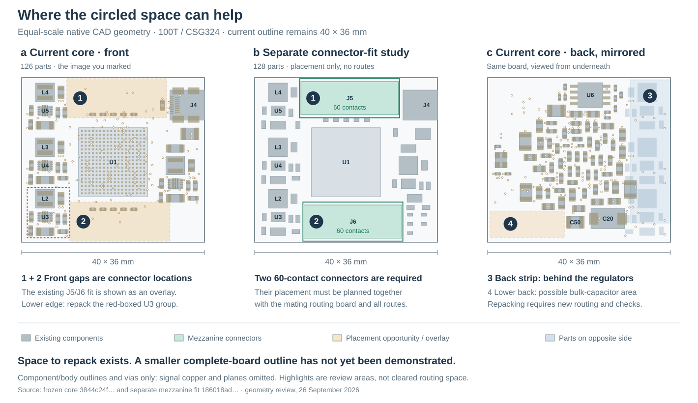

# Smaller-board study — circled spaces

26 September 2026. Follow-up to the marked front/back PCB image. The original 40 × 36 mm core and both earlier studies are preserved.

**A 37.5 × 36 mm placement candidate retains all 128 components of the mezzanine study, including both 60-contact connectors.** Its outline is 1,350 mm², compared with 1,440 mm²: **6.25% less area**. This is a separate placement study, not a routed replacement for the current core or a manufacturing release. See the [native verification](candidate/reports/Candidate_Validation.md) and [independent check](independent_candidate/Independent_Candidate_Review.md).

## What the circles show

| Marked area | What occupies the same physical space | Useful change |
| --- | --- | --- |
| Front, upper gap | J5 in the separate connector-inclusive layout; flash and capacitors on the back | Keep the required connector; shift its position together with the mating routing board |
| Front, lower gap | J6 in that layout; bulk capacitance on the back | Keep the required connector; shrinking height needs a different connector arrangement |
| Back, long right-hand strip | The back image is mirrored: this is behind the three front-side regulators | Place suitable complete groups on the back, then redesign their copper and check heat/return paths |
| Back, lower-left gap | Opposite the front core-power group, with some existing back-side capacitors | Can support repacking; one empty face alone does not justify trimming the shared outline |

The front lower central opening is about **22 × 6.705 mm** without same-side component courtyards. The existing converter groups need at least **9.01 mm** in their narrowest direction. Those are geometric measurements before routing, via, assembly and thermal allowances; they are not certified free placement area. The detailed [area audit](area_audit/Circled_Area_Audit.md) and [power review](power_audit/Power_Minimization_Review.md) distinguish those constraints.

## Concrete smaller arrangement

The new candidate starts from the **unrouted 128-component mezzanine study**, not from the partially routed 126-component core. No working copper is claimed to have been preserved or completed in this copy; its source already has zero tracks, vias and zones.

- Move the complete eight-part ASIC-bank converter and ten-part core converter to the sparse back-left region. Preserve each group's component and pad geometry by a rigid mirror/translation.
- Move the four-part oscillator group and C82 to the front.
- Shift J4 inward 1.9 mm, J5 left 2.1 mm, C1 left 2.05 mm, and R110/R111 left 1.0 mm.
- Keep U1, J6, the other two converter groups and every remaining part in their baseline positions. The resulting split is **39 front / 89 back**.

See the [exact placement plan](connector_audit/Placement_37p5x36_Plan.json) and [connector constraints](connector_audit/Connector_Size_Constraints.md). The new J5-to-J6 center offset is **(+2.8, +27.0) mm**, so the mating routing board must change with this candidate. That interface geometry is proposed, not an approved manufacturing contract.

The J4 suggested-edge discrepancy is reduced from 0.70 mm to approximately **0.10 mm inward**. It is **not resolved**. Estimated shell-copper edge clearance is 0.525 mm against the saved 0.50 mm rule; an exact receptacle/plug mechanical review is still needed. The mezzanine courtyard edge margin remains a tight 0.225 mm. Native geometry checks do not establish assembly acceptance.

## Placement verification and narrow margins

The native board was reopened in a fresh KiCad process and compared by reference, numbered pad, net, coordinates and side. Native KiCad DRC reports **zero physical violations and 383 unconnected items**, with no ignored checks or exclusions. An independent readback passed 3,198 assertions over all 128 footprints and 807 pad records. No integrated schematic exists, so schematic parity was not checked. The smallest measured component-courtyard gap is 0.030 mm (J5/R109); the nearest opposite-side hole-to-courtyard margin is 0.225 mm (J5/L4). These tight gaps are not approved assembly tolerances. J4’s body intentionally projects beyond the board edge; plug access still needs a mechanical check.

## What still determines the final size

This candidate excludes the rail revision's C92/R122, required input/link protection and the completed FPGA application connections. Its 120 new numbered mezzanine pads and eight cable data pads remain unassigned; the 117 ASIC signals still need FPGA balls and routes. Existing assigned-net connectivity counts do not include that unimplemented work.

Moving regulators onto the opposite side also changes heat spreading, ground return, FPGA escape access and decoupling paths. Preserving a component pattern does not preserve electrical performance. Integration must include the selected bank/configuration rails, complete power copper, all ASIC/link routing, the real fabrication stackup, and the mating-board height/retention envelope before committing to an outline.

With the current same-face horizontal connector/FPGA/connector arrangement, those three courtyards alone require about **35.55 mm height** using the explicitly stated 0.20 mm separation / 0.50 mm edge screening assumptions. Further height reduction would require changing that arrangement. Orthogonal connectors offer another layout to investigate, but a complete 32–34 mm square board has **not** been demonstrated.

The 37.5 × 36 mm result is a concrete incremental placement improvement, not proof of the global minimum. All 18 full-system uncertainties and six known implementation gaps remain open.
