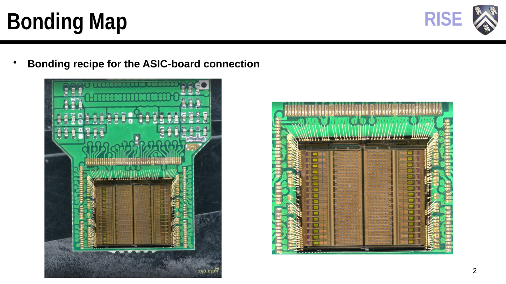
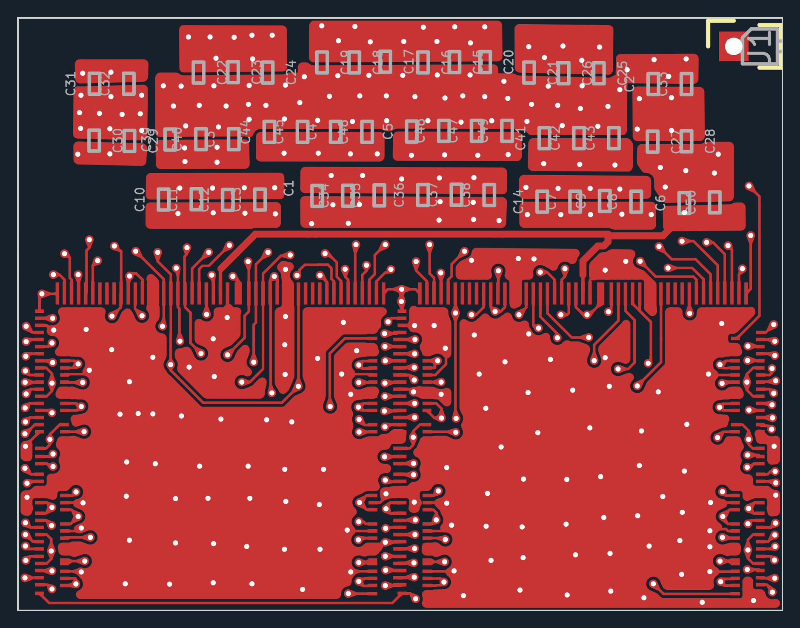
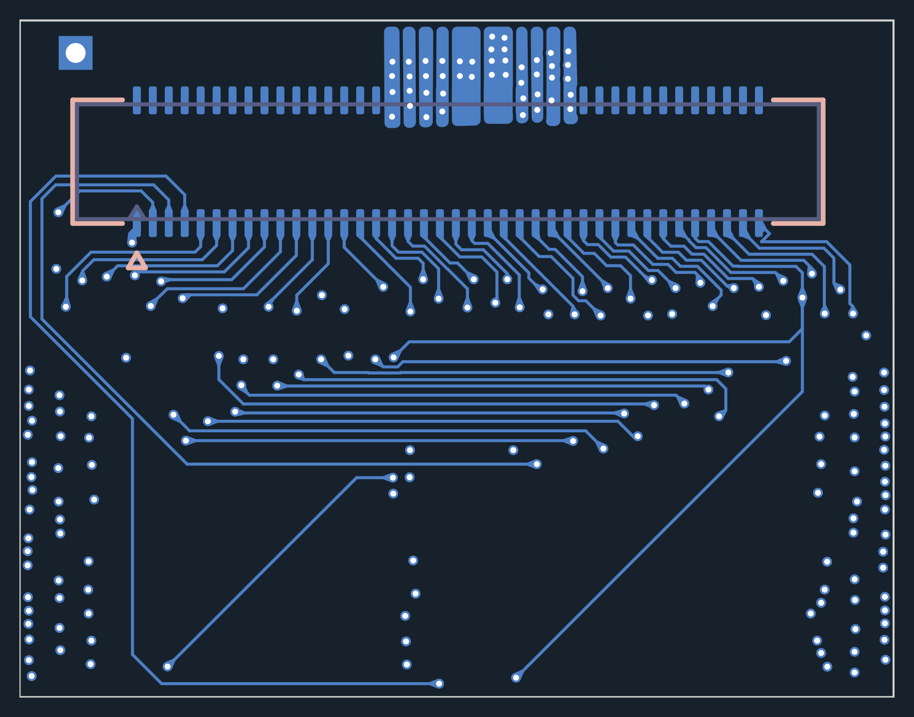
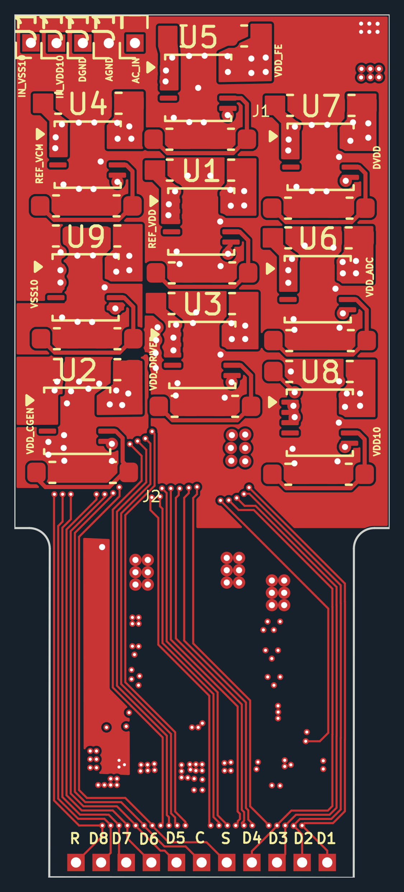
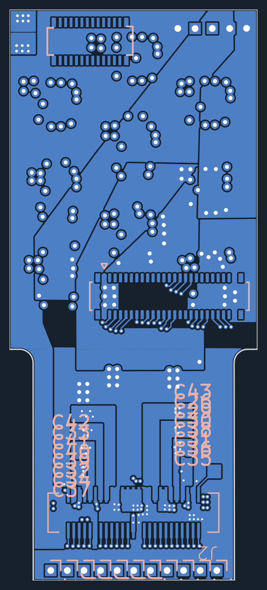

# Board and system overview

Use these views to recognize the supplied boards, locate the main components and open the corresponding design files. The collection contains chip-carrier and LDO/routing references; it does not yet contain a finalized full-4K FPGA board or complete assembly.

## Overall 3D assembly

**[Open the 3D STL](assembly/stacked_headboard_original.stl)** · [Download STL](assembly/stacked_headboard_original.stl?raw=true) · [Assembly guide and source details](assembly/README.md)

The earlier model discussion identified **A** as four ASIC-carrier boards with two ASICs each, **B + C** as the routing PCB, and **D** as the FPGA PCB. This is the original supplied arrangement model, with provisional dimensions and no encoded physical units. It covers the headboard assembly; the downstream KR260 and PC are shown in the functional diagram below. Its original author is unverified.

## Where the boards fit

The [September 17 meeting](../docs/meetings/2026-09-17.md#system-and-responsibilities) records this functional path:

The chip carrier supports the recording chips and their connections. Routing brings chip signals toward the FPGA, which receives and organizes data for the downstream platform. The diagram shows the intended data path, not a mechanical stack or final connector map. The [interface, power and startup questions](../docs/meetings/2026-09-17.md#questions-to-resolve-in-the-next-review) remain part of the design work.

## Original assembled-board photograph

Slide 2 of the [interface presentation](../sources/slides/Chip_FPGA_Interface.pptx) shows a single-chip carrier and the bond wires connecting the die to the board. This is a separate source example from the two-chip PCB-5 layout below. Open the [full slide PDF](../sources/slides/Chip_FPGA_Interface.pdf) for the original presentation context.

## ASIC carrier PCB-5

The supplied board outline is approximately **22 × 17 mm**, with **10 copper layers**. The front has two chip footprints, `U01_BCD1` and `U01_BCD2`, with surrounding capacitors. The back has the **80-contact J3 connector**.

| Front layout | Back layout |
|---|---|
|  |  |
| [Open scalable front view](previews/asic-carrier-front.svg) | [Open scalable back view](previews/asic-carrier-back.svg) |

Original files: [KiCad project](references/asic-carrier/PCB.kicad_pro) · [PCB](references/asic-carrier/PCB.kicad_pcb) · [schematic](references/asic-carrier/PCB.kicad_sch) · [pin-planning spreadsheet](references/asic-carrier/Pins.xlsx).

## LDO/routing reference

The supplied board outline is approximately **18.3 × 42.0 mm**, with **6 copper layers**. Nine regulator footprints, `U1`–`U9`, occupy the front-side regulator area. The narrower extension carries routing toward the lower connector region. The back includes two **50-contact board-to-board connectors**; the original file also preserves a separate 24-contact footprint with a duplicate `J1` reference.

| Front layout | Back layout |
|---|---|
|  |  |
| [Open scalable front view](previews/ldo-routing-front.svg) | [Open scalable back view](previews/ldo-routing-back.svg) |

Original files: [KiCad project](references/ldo-routing/PCB.kicad_pro) · [PCB](references/ldo-routing/PCB.kicad_pcb) · [schematic](references/ldo-routing/PCB.kicad_sch) · [connector-footprint library](references/ldo-routing/LDO_Board.pretty/).

## Reading these views

The 3D images are CAD renders, not photographs of assembled hardware. Unavailable custom 3D models are absent; use the layout views and original CAD to identify all footprints. Back layouts are mirrored to show the board from its back side. Dimensions describe the supplied outlines and are not new-board size targets. The two references are **not a confirmed mating pair**: their 80- and 50-contact interfaces require reconciliation.

See the [hardware opening notes](README.md), [rendering notes](previews/README.md) and [source provenance](../sources/README.md) for file versions and reproduction details. The [team follow-up](../docs/meetings/2026-09-18-follow-up.md) and [program guide](../docs/software.md) connect these hardware references to the ongoing interface and software work.
