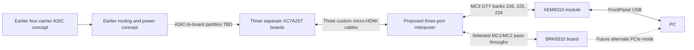
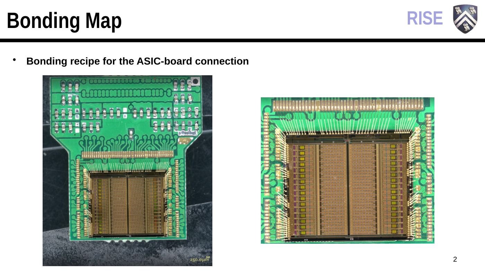
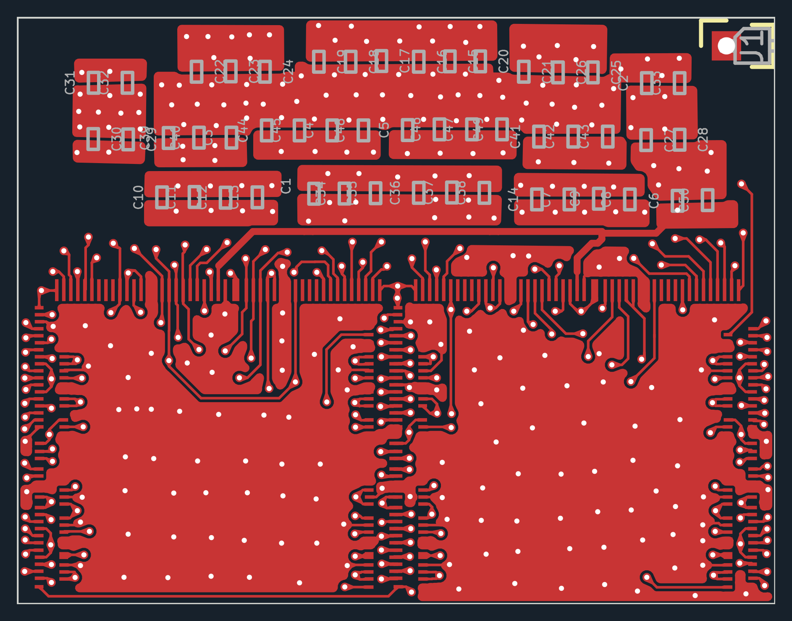
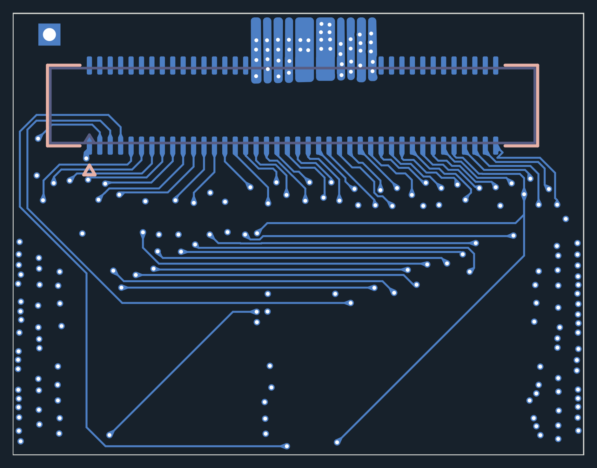
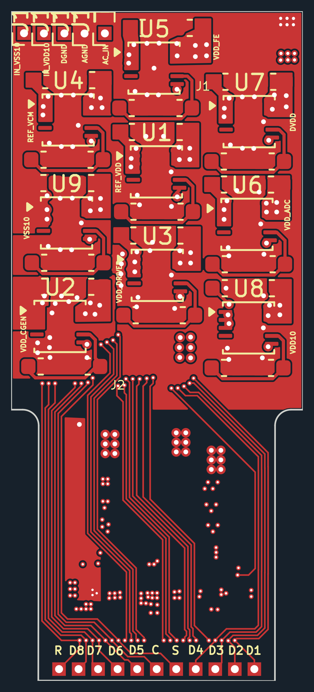
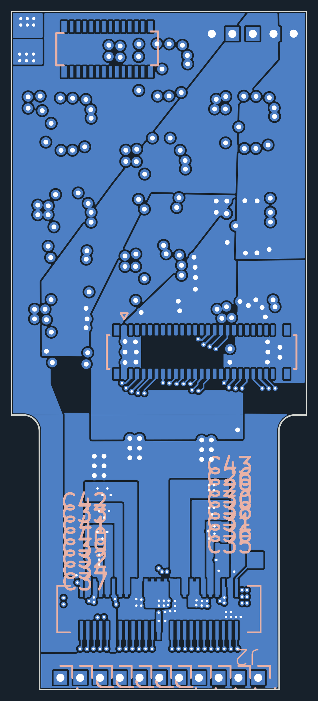

# Board and system overview

**Current direct backup review · 5 October 2026:** [XEM8305 Direct R2](../presentation/xem/direct-all-connectors-2026-10-05.html) · [native project, four-page schematic and checks](../presentation/downloads/#xem8305-direct-r2). All three module sockets and 260 contacts are accounted for in a routed CAD candidate. Its fresh public ERC/DRC/opens/parity checks are zero; actual fit, power, ASIC timing, DFM and operation remain unqualified. The earlier board references and architecture below retain their original dates.

[Native schematic browser](../presentation/schematic/?board=adapter) · [selected 25T circuit](../presentation/schematic/?board=fpga25t) · [R10 HDI feasibility and editable project](../hardware/xem8310-adapter/dated/2026-09-29/r10-hdi-feasibility/README.md). R10 connects all twelve selected GTY pairs and preserves all 160 MC1/MC2 contact paths, with 0 physical DRC violations under provisional HDI rules, 97 opens and 19 parity findings. It requires laser microvias and a qualified stackup; power/JTAG, returns, impedance, pair matching and fit remain incomplete. R9 remains the default viewer baseline, with R10 available as an optional study. Both board schematics can be browsed sheet by sheet and opened as PDFs.

Use these views to recognize the supplied boards, locate the main components and open the corresponding design files. The collection contains chip-carrier and LDO/routing references; it does not yet contain a finalized full-4K FPGA board or complete assembly.

## Overall 3D assembly

**[Open the 3D STL](assembly/stacked_headboard_original.stl)** · [Download STL](assembly/stacked_headboard_original.stl?raw=true) · [Assembly guide and source details](assembly/README.md)

The earlier model discussion identified **A** as four ASIC-carrier boards with two ASICs each, **B + C** as the routing PCB, and **D** as the FPGA PCB. This is the original supplied arrangement model, with provisional dimensions and no encoded physical units. It covers the headboard assembly; the current downstream receiver and PC are shown in the functional diagram below. Its original author is unverified.

## Where the boards fit

The selected [25T custom FPGA section](../presentation/fpga/current-25t.html) and [three-port adapter study](../presentation/adapter/) use the following proposed data path. There are three separate custom FPGA boards and cables, sharing one XEM8310 receiver. The [September 17 meeting](../docs/meetings/2026-09-17.md#system-and-responsibilities) used KR260; that receiver choice is historical:

```mermaid
flowchart LR
    A[Earlier four-carrier ASIC concept] --> B[Earlier routing and power concept]
    B -.->|ASIC-to-board partition TBD| C[Three separate XC7A25T boards]
    C <-->|Three custom micro-HDMI cables| D[Proposed three-port interposer]
    D <-->|MC3 GTY banks 226, 225, 224| E[XEM8310 module]
    E <-->|FrontPanel USB| F[PC]
    D <-->|Selected MC1/MC2 pass-throughs| G[BRK8310 board]
    G -.->|Future alternate PCIe mode| F
```

Each custom FPGA would receive and organize ASIC data, but the partition from the earlier four-carrier concept across three FPGA boards has not been defined. Its two planned active recording pairs enter XEM GTY RX, with a third pair assigned but reserved. One reverse GTY pair carries commands so that FPGA can generate ASIC CLK, DATA and LATCH locally. The proposed interposer is a distinct board between XEM and BRK. The [R7 schematic](../hardware/xem8310-adapter/dated/2026-09-29/r7-three-port/BRK8310_Three_Port_Adapter_R7_Candidate.pdf) diverts MC3 bank 226/225/224 pairs to three µHDMI ports and isolates the matching BRK GTY contacts. The [R10 HDI PCB study](../presentation/adapter/#r10-board) connects all 12 selected signal pairs under provisional fine-via rules, but97 items and all channel qualification remain open. XEM USB is the initial PC path. BRK PCIe is an alternate future configuration, since the three-link layout occupies GTY lanes used by J6. Stack fit, power-source protection and current budget for three 12 V cables, routing-board power, GTY clocking/link, custom-FPGA JTAG, ASIC fanout and host throughput remain open. The older [50T board review](../presentation/fpga/index.html) is historical.

## Original assembled-board photograph

Slide 2 of the [interface presentation](../sources/slides/Chip_FPGA_Interface.pptx) shows a single-chip carrier and the bond wires connecting the die to the board. This is a separate source example from the two-chip PCB-5 layout below. Open the [full slide PDF](../sources/slides/Chip_FPGA_Interface.pdf) for the original presentation context.

## ASIC carrier PCB-5

The supplied board outline is approximately **22 × 17 mm**, with **10 copper layers**. The front has two chip footprints, `U01_BCD1` and `U01_BCD2`, with surrounding capacitors. The back has the **80-contact J3 connector**.

| Front layout | Back layout |
|---|---|
|  |  |
| [Open scalable front view](previews/asic-carrier-front.svg) | [Open scalable back view](previews/asic-carrier-back.svg) |

Original files: [KiCad project](references/asic-carrier/PCB.kicad_pro) · [PCB](references/asic-carrier/PCB.kicad_pcb) · [schematic](references/asic-carrier/PCB.kicad_sch) · [pin-planning spreadsheet](references/asic-carrier/Pins.xlsx).

## LDO/routing reference

The supplied board outline is approximately **18.3 × 42.0 mm**, with **6 copper layers**. Nine regulator footprints, `U1`–`U9`, occupy the front-side regulator area. The narrower extension carries routing toward the lower connector region. The back includes two **50-contact board-to-board connectors**; the original file also preserves a separate 24-contact footprint with a duplicate `J1` reference.

| Front layout | Back layout |
|---|---|
|  |  |
| [Open scalable front view](previews/ldo-routing-front.svg) | [Open scalable back view](previews/ldo-routing-back.svg) |

Original files: [KiCad project](references/ldo-routing/PCB.kicad_pro) · [PCB](references/ldo-routing/PCB.kicad_pcb) · [schematic](references/ldo-routing/PCB.kicad_sch) · [connector-footprint library](references/ldo-routing/LDO_Board.pretty/).

## Reading these views

The 3D images are CAD renders, not photographs of assembled hardware. Unavailable custom 3D models are absent; use the layout views and original CAD to identify all footprints. Back layouts are mirrored to show the board from its back side. Dimensions describe the supplied outlines and are not new-board size targets. The two references are **not a confirmed mating pair**: their 80- and 50-contact interfaces require reconciliation.

See the [hardware opening notes](README.md), [rendering notes](previews/README.md) and [source provenance](../sources/README.md) for file versions and reproduction details. The [team follow-up](../docs/meetings/2026-09-18-follow-up.md) and [program guide](../docs/software.md) connect these hardware references to the ongoing interface and software work.
