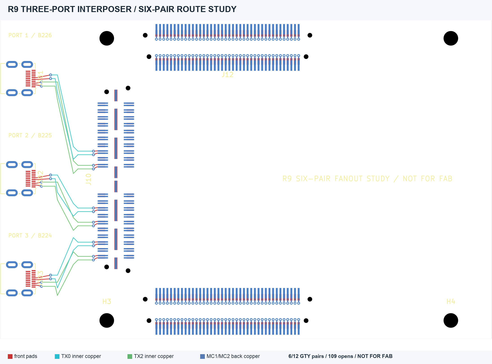

# R9 six-pair interposer routing study — 29 September 2026

**Partial KiCad routing experiment. The three links cannot operate yet, and this board is not for fabrication.** The [editable project ZIP](R9_Three_Port_Interposer_Public_Study.zip) contains the complete native project, all seven hierarchical schematic sheets and local KiCad symbol/footprint libraries. Extract the ZIP before opening its `.kicad_pro` file. R8 remains a [separate earlier study](../r8-partial-pcb/README.md).

R9 preserves R8's board outline, six XEM/BRK stack connector footprints, three Type-D receptacles, four mounting holes and **160 connected MC1/MC2 pass-through contacts**. It routes two GTY pairs for each of three ports: recording **TX0** at cable contacts 3/5 and the **reserved TX2** at 9/11. Recording TX1 at 6/8 and reverse control at 12/14 remain **open on all three ports**. The six routed pairs therefore do not form even one complete proposed link. The selected lower BRK-facing MC3 GTY contacts remain isolated to avoid stubs.

At the provisional **0.15 mm** KiCad study rule, DRC found **zero physical violations**, but **109 unconnected items** remain. There are **19 schematic-parity warnings** tied to unplaced placeholder circuits and fields. The study rule is not a fabricator-approved stackup, trace width, clearance or via process. There is no verified GTY impedance, pair skew, return path, AC coupling, reference clock, mated fit or operating test. JTAG probe headers, three protected 12 V branches and cable plug/stack connector bodies are not implemented in this PCB or 3D export.

Review the [native copper SVG](R9_copper_all_layers.svg), [unchanged eight-page logical schematic](R9_logical_schematic_unchanged_from_R8.pdf), and [DRC JSON](drc_with_parity.json). The public ZIP is a portable project-only derivative of the dated local R9 study; it omits the generated STEP and historical failed 12-pair routing attempt. [Opal Kelly publishes the XEM8310/BRK8310 mechanical models](https://www.opalkelly.com/products/models/) separately.
