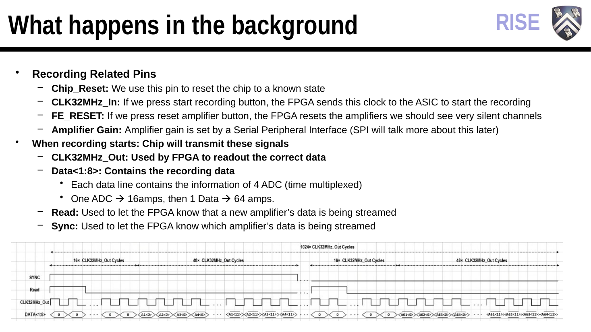

# ASIC/interface slides

- [Download the original PowerPoint](Chip_FPGA_Interface.pptx?raw=true)
- [Open the PDF](Chip_FPGA_Interface.pdf)
- [Read searchable slide text](../../docs/slides/asic-interface-text.md)

The complete 28-slide deck is included. The PDF and selected PNG previews are alternate representations for reading the same material.

[Overall board views and system context](../../hardware/overview.md)

[Source credits and file checksums](../README.md)
